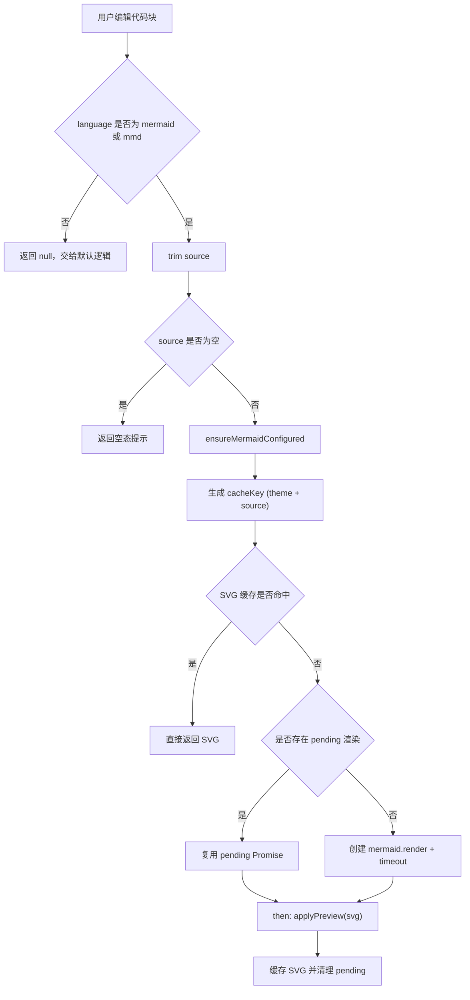
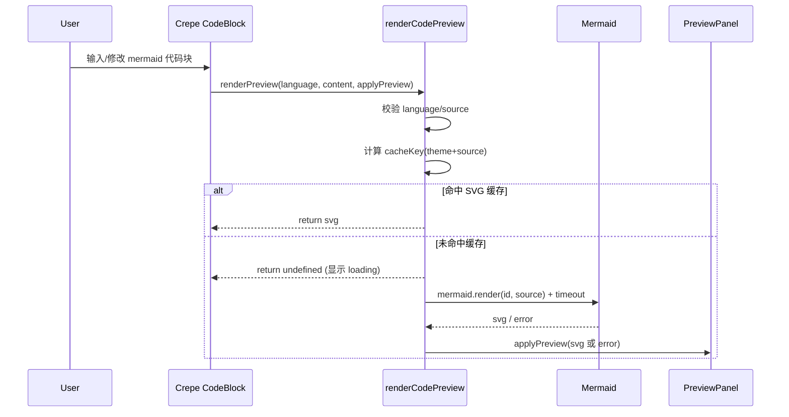

# MarkFlow Mermaid 渲染集成说明

本文档将介绍快速接入和完整逻辑，面向两类读者：

- 快速实现：先看第 2 节，按最小步骤落地。
- 完整逻辑：看第 3～8 节理解完整设计与注意事项。

---

## 1. 目标与边界

- 在代码块语言为 `mermaid` / `mmd` 时渲染图表预览。
- 不影响非 Mermaid 代码块编辑体验。
- 支持主题切换（亮色/暗色）后的重渲染。
- 避免重复渲染导致卡住或性能浪费。
- 渲染失败时给出错误反馈，不出现“无反馈”状态。

---

## 2. 快速接入（TL;DR）

### 2.1 接入位置

核心文件：

- `src/features/app/WysiwygMarkdownEditor.tsx`
- `src/index.css`

在 Crepe 的 `CodeMirror` feature 中挂载 `renderPreview`：

```ts
[Crepe.Feature.CodeMirror]: {
  previewOnlyByDefault: true,
  previewLabel: 'Diagram Preview',
  previewLoading: '<div class="mf-mermaid-preview-loading">Rendering diagram...</div>',
  renderPreview: renderCodePreview,
}
```

### 2.2 最小实现要点

1. 识别语言：只处理 `mermaid` / `mmd`。
2. 初始化 Mermaid：按主题设置 `theme`，并显式设置 `htmlLabels: false`。
3. 渲染策略：`cache + pending Promise 去重 + timeout`。
4. 主题切换：清空 `theme/cache/pending` 后触发 `replaceAll` 重绘。
5. 样式兜底：确保 `svg text/tspan` 在深浅主题都可见。

### 2.3 最小核心代码骨架

```ts
const MERMAID_LANGUAGE_ALIASES = new Set(['mermaid', 'mmd'])
const MERMAID_RENDER_TIMEOUT_MS = 12_000

const mermaidThemeRef = useRef<null | 'dark' | 'default'>(null)
const mermaidSvgCacheRef = useRef(new Map<string, string>())
const mermaidPendingRenderRef = useRef(new Map<string, Promise<string>>())
const mermaidRenderSeqRef = useRef(0)

const ensureMermaidConfigured = () => {
  const theme = resolveMermaidTheme()
  if (mermaidThemeRef.current === theme) return theme

  mermaid.initialize({
    securityLevel: 'strict',
    startOnLoad: false,
    theme,
    htmlLabels: false,
    flowchart: { htmlLabels: false },
  })

  mermaidThemeRef.current = theme
  mermaidSvgCacheRef.current.clear()
  mermaidPendingRenderRef.current.clear()
  return theme
}
```

### 2.4 快速自测清单

1. 两个 Mermaid 代码块同时存在时，是否都能完成渲染。
2. 错误语法时是否展示错误而非长期 loading。
3. 切换亮暗主题后文字是否仍可见。
4. 连续快速输入时是否出现错图或卡住。

---

## 3. 整体渲染流程



---

## 4. 实现细节

### 4.1 Mermaid 语言识别

- 用 `MERMAID_LANGUAGE_ALIASES` 统一识别 `mermaid` 与 `mmd`。
- 非 Mermaid 代码块返回 `null`，交给编辑器默认逻辑处理。

### 4.2 Mermaid 初始化

每次渲染前通过 `ensureMermaidConfigured` 按当前主题初始化：

- `securityLevel: 'strict'`
- `startOnLoad: false`
- `theme: 'default' | 'dark'`
- `htmlLabels: false`
- `flowchart.htmlLabels: false`

### 4.3 缓存与并发去重

使用两个 Map：

- `mermaidSvgCacheRef: Map<string, string>`
- `mermaidPendingRenderRef: Map<string, Promise<string>>`

规则：

- 同一 `theme + source` 只渲染一次。
- 并发触发相同图时复用同一个 pending Promise。
- 渲染完成后写入 SVG 缓存并移除 pending。

### 4.4 超时保护

`withTimeout` 为 `mermaid.render` 增加超时兜底（当前 12 秒）：

- 正常返回：展示 SVG。
- 超时/异常：展示错误 `<pre class="mf-mermaid-preview-error">...`。

### 4.5 主题切换重渲染

监听 `document.documentElement[data-theme]` 变化：

- 清空 Mermaid 主题状态
- 清空 SVG 缓存
- 清空 pending 渲染
- 用当前 markdown 触发 `replaceAll` 重绘

---

## 5. 渲染时序图（编辑器到预览面板）



---

## 6. 样式层要点

`src/index.css` 中 Mermaid 预览相关样式需至少包含：

- `.preview` 容器的背景与边框
- `svg` 自适应宽高
- `svg text, svg tspan { fill: currentColor; }`

最后一条用于保证文本在深色/浅色主题下可见。

---

## 7. 故障修复记录（必看注意事项）

### 7.1 问题一：预览长期停留在 `Rendering diagram...`

现象：

- 图表一直 loading，不进入成功/失败态。

根因：

- 早期用“全局递增 requestId + 只保留最新请求”策略。
- 多 Mermaid 代码块并发时，前一个块结果被后一个块当作“过期结果”丢弃。
- 被丢弃块未收到 `applyPreview`，因此卡在 loading。

修复：

- 移除跨块互斥的“全局最新请求”判定。
- 改为按 `theme + source` 做 pending 去重与缓存复用。
- 增加渲染超时兜底，保证有终态输出。

### 7.2 问题二：图能显示但文字消失

现象：

- 线框/节点存在，但文字为空白。

根因：

- 预览层会对字符串 HTML 做 DOMPurify 清洗。
- Mermaid 某些图类型可能使用 HTML label（`foreignObject`）。
- 清洗后 label 内容被剥离，形成“有图无字”。

修复：

- Mermaid 初始化显式设置 `htmlLabels: false`（含 `flowchart.htmlLabels: false`）。
- 输出纯 SVG 文本节点。
- CSS 增加 `svg text/tspan` 颜色兜底。

---

## 8. 回归验证与后续优化

回归验证建议：

1. 单个 Mermaid 代码块是否正常渲染文本与连线。
2. 同文档多个 Mermaid 代码块是否都能结束 loading。
3. 快速连续编辑时是否出现卡住或错图。
4. 切换亮暗主题后是否自动重渲染且文字可见。
5. 错误语法是否能显示错误信息而非长期 loading。

建议执行：

- `pnpm lint`
- `pnpm build`

后续可选优化：

- 为 `cacheKey` 增加 Mermaid 版本维度，避免升级后旧缓存污染。
- 对超时错误增加一次自动重试（仅 1 次）。
- 增加渲染埋点（成功率、耗时、超时率）便于稳定性优化。
